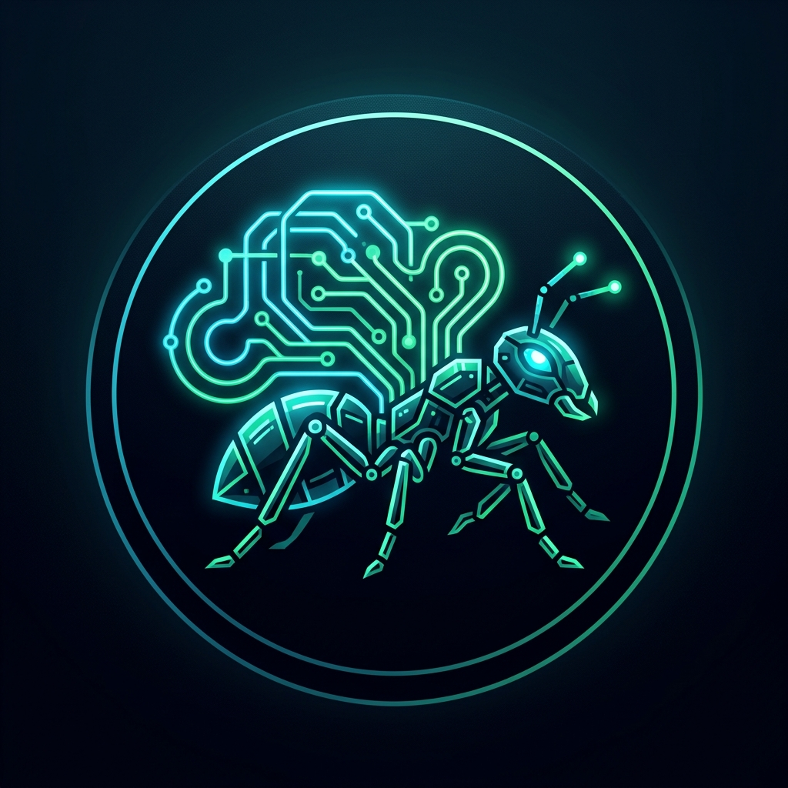

# <p align="center"><br>Ant Agent</p>

<p align="center">
  <strong>A private, offline-first local AI pair programmer & personal assistant CLI.</strong>
</p>

<p align="center">
  
  
  
  
</p>

---

**Ant Agent** is a developer companion designed to run locally. Built on the philosophy that **small models (e.g., 1B to 30B parameters) shouldn't try to memorize the world—they should call the right tools**, Ant Agent acts as the ultimate local orchestrator. It bridges the reasoning gap by combining a small local model with persistent memory, computation engines, and filesystem controls.

---

## 🚀 Key Features

* **💻 Immersive Terminal UI (TUI)**: Powered by `rich` and `prompt_toolkit`. Features animated console states, syntax-highlighted outputs, and command autocompletion.
* **🧠 Persistent Multi-Session Resumption**: 
  * Automatically creates workspace session logs under `.ant_agent/sessions/`.
  * Resume any chat history with full token stats using `python ant_agent.py resume <session-uuid>`.
* **🗂️ Segregated Hybrid Memory System**: Routes memory context intelligently between Global Memory (`~/.ant_agent/memory.json`) and Workspace Memory (`.ant_agent/memory.json`).
* **💭 Thought Visualization Panel**: Renders private chain-of-thought blocks (`<think>...</think>`) in a styled side panel (toggle via `/thinking`).
* **📊 Real-time Cost & Token Analytics**: Tracks prompt/completion token consumption with built-in estimates.
* **🛠️ Developer-First Local Tools**:
  * Code Execution (`python_repl`)
  * Local/Web Fetching & Scraping (`web_search` with Trafilatura)
  * Sandbox Testing (`code_runner_with_tests`)
  * File Management (`filesystem_write`, `filesystem_edit`, `filesystem_delete`, `grep_search`)

---

## 📦 Installation & Setup

1. **Clone & Navigate**:
   ```bash
   cd Path/to/ant-agent
   ```

2. **Install Dependencies**:
   ```bash
   pip install -r requirements.txt
   ```

3. **Configure Settings**:
   The configuration file is automatically created in `~/.ant_agent/config.json` upon first startup. Update it with your preferred model configuration:
   ```json
   {
       "llm_base_url": "https://generativelanguage.googleapis.com/v1beta/openai/",
       "llm_api_key": "YOUR_API_KEY",
       "llm_model": "gemma-4-26b-a4b-it",
       "embedding_provider": "any" // ollama qwen3-embedding:0.6b is suggested
   }
   ```

---

## ⚡ Usage

### Start Interactive Chat
```bash
python ant_agent.py chat
```

### Resume Saved Sessions
List all saved sessions in this workspace:
```bash
python ant_agent.py resume
```
Resume a specific session:
```bash
python ant_agent.py resume <session-uuid>
```

### Interactive Commands
While in a chat session, you can use these shortcuts:
* `/help` - Show available slash commands.
* `/tools` - List all active tool schemas.
* `/config` - Show active configuration settings.
* `/thinking` - Toggle the visibility of the agent's thought process scratchpad.
* `/stats` - Print session token utilization and cost metrics.
* `/clear` - Reset current conversation history in memory and clear the screen.
* `/wipe` - Wipe all saved session histories in this workspace.
* `/exit` or `/quit` - Safely exit chat session and display utilization summary.

---

## 🧪 Development & Testing

Unit tests are isolated using a temporary directory sandbox to avoid corrupting active user workspace data:
```bash
python -m unittest test_ant_agent.py
```

---

## 🗺️ Roadmap & Checklist

### Completed Features
- [x] **Support for regular memory and recall**: Store and query workspace and global contextual data locally.
- [x] **Session system**: Auto-save and resume chat histories with unique session UUIDs.
- [x] **File operations**: Read, write, edit, delete, and search workspace files.
- [x] **Page scraper**: Web fetch and extraction to supply clean markdown content.

### Yet to Do
- [ ] **Improved stats on cost and token consumption**: Support precise tracking for a wider range of model APIs and local providers.
- [ ] **Improved long-term memory**: Integrate semantic reranking and smarter context truncation for vector embeddings.
- [ ] **Improved TUI**: Add interactive menus, scrollable panels, and enhanced theme configuration.
- [ ] **Multimodal inputs**: Integrate vision capabilities to analyze screenshots and local image/PDF files.
- [ ] **Pip package of Ant Agent**: Package and distribute Ant Agent on PyPI for easy installation.
- [ ] **Agent Orchestration**: Support auto-deployment of sub-agents to distribute heavy workloads and finish tasks faster.
